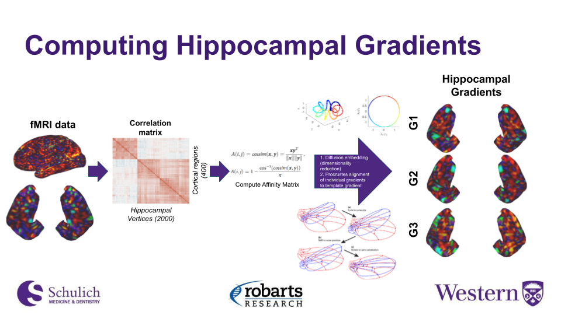

Hippogradients
============

Pipeline for extracting gradients from cleaned fmriprep output applied to hippunfold surfaces

Next steps:
- computing functional connectivity from upper and lower quartiles of hippocampal gradients as ROIs vs 7 yeo functional networks
- computing differences in average gradient values 
- data visualization (functional connectivity spider plots)
